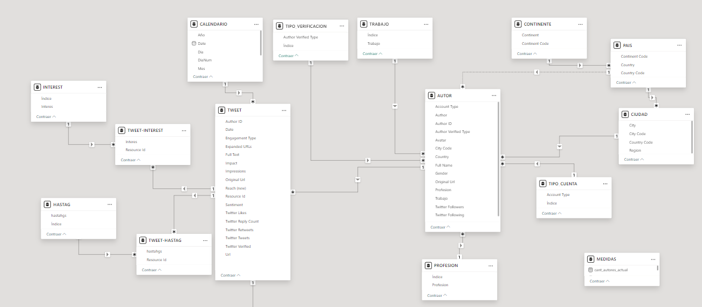
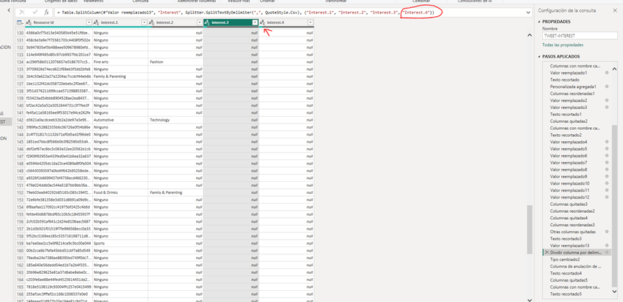
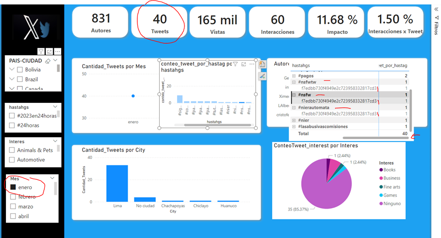
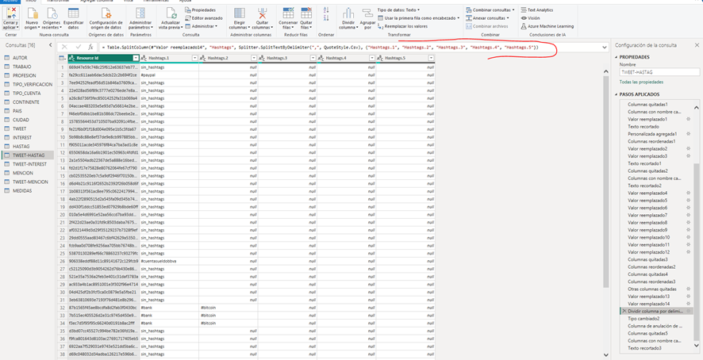

# Analisis de Twitter
Proyecto realizado con Power BI,
los datos son de una fuente de archivos excel 
-Aplicación de modelado y diagrama dimensional copo de nieve 
-Se realizó la limpieza de datos del archivo excel con ayuda de Power Query(conceptos de dinamización de las columnas, división por delimitadores, limpieza de caracteres con lenguaje M) 
-Se verificó la fidelidad de los datos realizando consultas SQL (el archivo Excel fue cargado a una base de datos) 
-Se realizó el correcto tipado de los datos.  
-Se implementó buenas prácticas para la creación de las funciones DAX. 
-Se implementó buenas prácticas para el manejo de los datos tipo DATE  

imagen del modelado tipo copo de nieve 
 
PASOS A REALIZAR PARA EL MODELADO 
1.	Identificar las entidades importantes del modelo de datos y definir las propiedades de cada una. 
2.	Realizar el modelado entidad relación en DRAW.IO para tener definidas mis entidades y propiedades. 
3.	Establecer las relaciones correctas entre cada entidad, considerando los ID de las entidades, depurando registros duplicados, irrelevantes y estableciendo las tablas secundarias. 

Para los siguientes pasos en PowerBI tengo que pulir algunos campos que se suman, en ‘no resumir’, esto es una buena práctica para dejar el modelo de datos intacto y crear una tabla “medidas” que se encargará de realizar las funciones DAX, de igual modo tengo que generar una entidad Calendario para manejar las fechas. 

DIFICULTADES y SOLUCIONES 
-TIPO DE DATO FECHA Y HORA (DateTime) es el formato original, pero tuve que cambiar el formato a DATE (sin la hora) para poder crear mi tabla Calendario 

-RELACIÓN PARA FILTRO PAIS 
mi relación entre es de continente->país->ciudad->autor->twiter
Resulta que siempre verifico los datos en una base de datos para corroborar que mis cálculos son correctos, pero mis consultas SQL me arrojaban resultados diferentes, ejemplo: tengo un Tweet que es del país de Brazil en SQL, pero en en mi filtro de PoweerBI no me arroja el resultado, me sale valor vacío cuando intentaba filtrar por país Brasil. Y no solo eso, sino que algunos tweets tenían país pero no ciudad y eso alteraba la fidelidad de los cálculos de KPI’S. Por ejemplo en la base de datos si filtraba por Perú, me arrojaba 977 tweets y en PowerBi con el mismo filtro me arrojaba 924. Resulta que al hacer mi conexión de tablas yo uno país con ciudad mediante el codigodeciudad y codigodeciudad lo uno a autor, pero en muchos casos algunos países tienen datos vacíos en ciudad, yo reemplacé esos valores null por nociudad, pero mi filtro al no encontrar el codigodeciudad por el cual se conecta con autor, no lo filtra (en una base de datos normalizada sería imposible que esos valores se llenen porque un FK de una tabla no puede estar vacío), pero POWERBI es más flexible, entonces mi solución fue, realizar 2 conexiones, por ciudad y por país(pienso que sería como implementar un index por país, como en una base de datos, la ventaja es que ‘país’ simula a un PK ya que “no se puede repetir”), por consecuencia si no tenía ciudad, pero si país, iba poder ser filtrado por país, ya que el país también es un valor ”único”PK, entonces no iba a tener problemas(Respecto a la limpieza que realicé, mis datos null, tenían el texto de “desconocido”, asimismo, se puede considerar en las técnicas de limpieza eliminar datos no relevantes, pero decidí no eliminarlos debido a que quería implementar una solución que no tenga que ver con eliminar datos).  

-TABLA DE TWEETS-HASTAGS 
mi medida para calcular tiene que ser un DISTINCTCOUNT debido a que en algunos el tweet aparece más de una vez en la tabla debido a que es una tabla de muchos a muchos ya que muchos tweets pueden tener muchos hastagsh, entonces cuando hago el conteo tengo que hacer un distinct de los tweets(CALCULATE,DISTINCTCOUNT Y FILTER) 

-TABLA DE TWEETS-INTEREST 
Tuve que hacer un ajuste en la limpieza debido a que no me había percatado que al dividir mis intereses en columnas, me había faltado una columna más porque un tweet tenía 4 intereses y yo había dividido en 3, entonces tuve que añadir una cuarta columna 
 

Verificando intereses por Tweets en mis filtros seleccionando Food & Drinks POWERBI me arrojaba 13, pero la base de datos me arrojaba 14. Siguiendo ese principio verificaba que con otros filtros igual los resultados eran inconsistentes. Entonces seleccionando esta diferencia mínima de 1 entre resultados, recolecté los 13 id que me arrojaba POWERBI y seleccioné los 14 registros que me arrojaba la base de datos, en SQL crucé los datos (LEFT JOIN) para identificar el ID que me faltaba y me di cuenta que este tenía 4 intereses, revisé mis datos y me dí cuenta que el máximo número de intereses en un tweet era 7, entonces tuve que corregir mi limpieza en los intereses. 

-VERIFICACIÓN DE MI CONTEO DE TWEETS Y HASHTAGS 
Un tweet puede tener infinidad de #hastaghs, pero eso no quiere decir que sean tweets diferentes. Ejemplo: el mes de enero yo tengo cuarenta Tweets, pero mis # hashtags son más de cuarenta, porque mi tweet tiene más de 1 #hashtags.  
Entonces mis filtros de #hashtags pueden ser varios pero muchos #hashtags pertenecen a un mismo Tweet en ese caso se cuenta una sola vez por tweet.
EJEMPLO:

 
 

Para hastaghs tengo el mismo problema la cantidad máxima de hastagsh son 13, tengo que aumentar columnas en mi limpieza 

 
 

Problema con los filtros cuando utilizamos tablas de relaciones muchos a muchos, en mi caso para contar con una medida DAX, si obtengo resultados, pero para filtrar no lo realiza  

 

En este caso investigando, una posible solución pero que no es una buena práctica es configurar los filtros (filtro cruzado) para ambas tablas en el modelado, pero compromete todo el modelo, entonces no es recomendable porque puede alterar los resultados. 
En este caso es mejor realizar los filtros de manera manual con lógica y con lenguaje DAX 
 
Se toma la variable porque, en el contexto no se puede acceder a la tabla Tweet, si ya tomaste otra tabla. 

Puntos a Mejorar 
-Se puede añadir las menciones para realizar un filtro por menciones de autores. 
-Pienso que el modelado depende mucho de los datos que se van a analizar y respecto a los requerimientos.
Entonces, por esa razón utilicé el modelo copo de nieve. Asimismo, normalicé pensando en que sería un modelo automático que alimentado de manera externa por ello consideré normalizar todas las posibles tablas implicadas. 

-Realizando el ejercicio he podido observar que muchos archivos exportados de ERP’s, sean formato txt, csv o xlsl. Vienen desnormalizados y en muchos casos algunos vienen sin sus Id o PK, he visto en otros ejemplos que en el modelado se realizan las conexiones mediante los nombres que “no se repiten” los foráneos de otras tablas. En mi caso también he realizado esa práctica en algunas tablas y en otras no, pero en mi opinión es mejor conectarlo mediante un PK o código ID, eso permitirá mayor eficacia y velocidad. 

-La Limpieza en PowerQuery ha reforzado mis conocimientos en dinamización de las columnas, limpieza de caracteres, división de columnas, limpieza con funciones de lenguaje M 

-Dejo esta documentación, alguna consulta u opinión de un modo para mejorar el modelo es bienvenido, sería de gran ayuda para seguir mejorando, siempre es bueno despejar las dudas y aprender !  

Las vistas del Dashboard se encuentran en la carpeta visualización 

